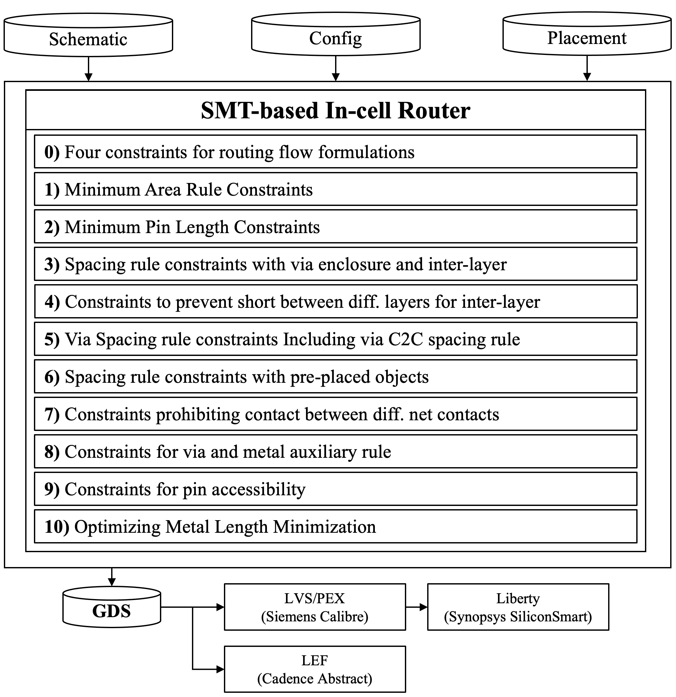

# Au-MEDAL: Adaptable Grid Router with Metal Edge Detection And Layer Integration
Au-MEDAL is an SMT-based standard cell router that handles various design rules and specifications at the nanometer scale for bidirectional routing. It incorporates techniques such as metal edge detection, inter-layer design rule checking, off-grid design rule handling, flexible routing grid spacing, and pin accessibility–aware routing. These capabilities enable Au-MEDAL to generate DRC-clean layouts in ASAP7 and fully integrate middle-of-line (MOL) layers into the BEOL routing.

This work was enabled by the generous academic support of *Cadence Design Systems*, *Synopsys*, and *Siemens EDA*. 
We gratefully acknowledge their provision of EDA tools and technologies used in this research.

Any indicators of correlation or performance presented herein are **not** and should **not** be construed as benchmarking 
of any commercial EDA tool, product, or vendor. Results are provided solely to enable reproducible academic research.

If you use Au-MEDAL in any published work, we would greatly appreciate it if you could cite this paper [1].

## Overall Framework

|  |
| :-----------------------------------: |
|            _Overall Flow_             |

## HOW TO BUILD
1. Our build Environments

For Au-MEDAL

`python 3.10`

`pip 3.10`

`anaconda v23.7.4`

For DP-Placer (Optional)

`gcc 10.3.0`

`g++ 10.3.0`

`cmake 3.18.0`

2. Build DP-based placement from *AutoCellGen* [\[2\]](https://github.com/The-OpenROAD-Project/AutoCellGen). (Optional)

**If you need the placement engine, please make sure to read the README file in the DP-Placer directory and follow the build instructions without Z3.**

You can follow the build instructions below. However, you may also use the provided placement file.

`cd DP-placer/MAKE/PLACE/csyn_fp`

`mkdir build`

`cd build`

`cmake ..`

`make`

3. Build environments for Au-MEDAL using *anaconda3*

`conda env create -f Environment.yml`

`conda activate Au-MEDAL`

## Execution Guide
Au-MEDAL: Standard-Cell Layout Router

`python3 main.py --save_dir {save_dir} --cell_name {cell_name} --schematic {schematic} --config {config} --placement_file {placement_file}`

For example, to run a single cell:

e.g.) `python3 main.py 
                    --cell_name NAND2x2_ASAP7_75t_R 
                    --schematic inputs/schematic/asap7sc7p5t.sp 
                    --config inputs/configs/7p5t_3F3F_SP.json 
                    --placement_file inputs/placement/Reference_7p5t/NAND2x2_ASAP7_75t_R.txt`

Or simply run:

`./run.sh`

to generate all cells.

- Input files
  - config.json: Defines the layer map, design rules, and design parameters.
  - schematic.sp: CMOS netlist.
  - placement.txt: Specifies the ordering of PFETs and NFETs, as well as the number of fins. It is used to calculate actual coordinates based on the M1 pitch and contacted poly pitch defined in config.json.

The placement.txt format is identical to the output format of DP-Placer.
We adopted this format because Au-MEDAL was initially developed using the placement output of *AutoCellGen* \[2\] 
, which was the most recent open-source transistor placer at the time.
We plan to support a more general format in the future.

For user convenience, we provide a variety of config files used in our experiments.

- Configuration parameters in config json file

  - **layer_map** : Mapping each element into GDS layers
  - **num_row** : The number of rows for multi-height cell. This feature is planned to be supported in the future.
  - **x(y)\_routing resolution** : Resolution of routing grid. "design_rules["x_routing_resolution"][layer_index] = 2" means twice as dense x routing layer of layer_index.
  - **metal_direction_priority** : This parameter determines which metal direction is prioritized during metal length optimization. If set to HORIZONTAL, horizontal metals are optimized first, followed by vertical metals. If set to BIDIRECTION, both directions are optimized simultaneously.
  - **allow_below_min_track** : In general, Au-MEDAL adds horizontal routing tracks in two directions: from the top of the cell down to the cell center, and from the bottom of the cell up to the cell center. When the cell height is not an integer multiple of the metal track pitch, this can result in tracks near the cell center being spaced more closely than the minimum pitch of the metal layer. If this option is set to true, such violations of the minimum metal pitch are allowed.
  - **addition_y_grid_for_pin** : Extension of Y grids to allocate pins.
  - **low_resolution_routing** : This parameter restricts the creation of routing grids to only where they are needed. By default, the x-coordinates of routing tracks are determined by CPP/2, but instead of generating tracks at all possible locations, tracks are created only at points that need to be connected. Since this option can potentially cause spacing DRC violations, it is recommended to use it only when the cell size is large but the routing demand is low.
  - **complexity_level** : When defining the routing grid, a parameter determines how finely the grid is generated. A higher value increases runtime, but can lead to better-quality solutions. Currently, only three values are supported: 0, 1, and 2.
    - 0: If addition_y_grid_for_pin = true, a routing grid is added only in the y-direction for external pins. Specifically, for external pins on the M1 metal layer, y-direction routing tracks are added, while x- and z-direction tracks are not generated.
    - 1: If addition_y_grid_for_pin = true, x-, y-, and z-direction tracks are added to the external pin metal layer in order to satisfy the pin length requirement. In addition, routing tracks are also added to the underlying layer of the external pin metal layer. For example, if the external pin layer is M1, routing tracks will also be added to the Gate layer. Since the pitch of LISD and M1 are different, additional routing tracks are inserted in LISD to avoid spacing design rule violations. (This behavior is specifically tuned for ASAP7, and users may remove it if desired. The corresponding code is in placeEnv.py, lines 614–622.)
    - 2: Includes all of the behavior in mode 1, and additionally inserts routing tracks in the upper layer of the external pin metal layer. For example, if M1 is the external pin layer, routing tracks will also be added to M2.
  - **ensure_access_points** : This parameter ensures at least one access point to the M2 metal layer. Enabling this option may increase runtime, so it is recommended to apply it only to cells where it is necessary.
  - **pin_stretch_aware** : This parameter adjusts the optimization priority to allow external pins to extend as much as possible in the vertical direction When optimizing metal length, the priority is determined from the cell center toward the top and bottom of the cell. If this parameter is set to true, two effects can be achieved:
    - The runtime is significantly reduced.  
    - External pins generated at the cell center can later be extended as far as possible in the vertical direction.
  - **max_tolerance** : A parameter that defines how much larger the routing region should be expanded beyond the routing bounding box.
  - **power_layer** : Types of layers used for power
  - **ext_pin_layer** : Types of layers used for pin
  - **cell_height** : Cell height
  - **minimum_pin_length** : Minimum pin length
  - **diffusion_break** : 1 for SDB / 2 for DDB
  - **extension** : Length of metal layer when it is in a fixed vertex.
  - **spacing** : Minimum space rules, it has four type (S2S, S2T, T2T, C2C).
  - **gate_contact_layer** : Type of layer used for gate contact
  - **active_contact_layer** : Type of layer used for active contact
  - **offset** : Defines the offset between two layers, specifying the required spacing or overlap between them.
  - **width** : Minimum width of layer
  - **min_side_len** : Minimum length of side
  - **power_width** : Width of a power metal
  - **min_area** : Minimum area of layer
  - **enclosure** : Length of metal extension from via
  - **no_overlap** : Layers that cannot be overlapped.
  - **routing_layers** : Types of routing layers
  - **routing_directions** : Routing directions of a layer. H for horizontal, V for vertical, B for Bidirectional.
  - **vias** : Types of via
  - **same_height_layers** : Layers that share the same layer and needed to be prevented from shorting.
  - **lower_via** : Types of layers used for lower via
  - **upper_via** : Types of layers used for upper via
  - **num_max_pmos_fins** : Maximum number of PMOS fins
  - **num_max_nmos_fins** : Maximum number of NMOS fins

If it is difficult to understand what the above parameters describe, simply run the code first and refer to the "database/<CELL_NAME>/layer_track_info" directory.

## Evaluation
Design evaluation can be performed using the script `utils/run_evaluation.py`.

This code supports running LVS, DRC, and PEX using Calibre from Mentor Graphics, and generating Liberty files using SiliconSmart from Synopsys. Additionally, it provides functionality to measure the area of a GDS file and to merge per-cell GDS layouts stored in subdirectories.

`python3 run_evaluation.py --save_dir {save_dir} --lib {True/False} --merge_gds {True/False} ...`

Due to licensing restrictions from Mentor Graphics, all rule-related contents for Calibre have been removed. To perform LVS/DRC/PEX on your own, please consider requesting the necessary rule files from the official source.

The *Cadence Abstract* flow was performed entirely through the GUI without the use of scripts. 
The Synopsys IP rights noted in the headers of Synopsys-related .tcl files have been adapted from examples found in [\[3\]](https://github.com/ABKGroup/PROBE3.0)

## Abstract Extraction (Cadence)

To generate the LEF file from GDS using the Cadence Abstract Generator, follow the steps below:

1. In **Open Library**, select `cdslib/asap7_TechLib` from the ASAP7 PDK.
2. In **Import Layout**, load the generated GDS file and use the layer map at `asap7_TechLib/asap7_TechLib.layermap`.
3. In **Import Logical**, specify the Verilog netlist located at `Verilog/{logic.v}` within the ASAP7 PDK.
4. In **Running step Pins** for the selected cell(s):
   - Add the following to *Map text label to pins*:  
     `"(M1 (M1 drawing)) (M2 (M2 drawing))"`
   - Add any unrecognized pin names if necessary.
   - Set the pin boundary layer to `"BOUNDARY"`.
5. In **Running step Extract**, proceed with default settings.
6. In **Running step Abstract**, set the site name to `"asap7sc7p5t"` and keep other settings as default.
7. Go to **File > Export > LEF...** and run *Export Geometry LEF DATA* to generate the LEF file.

<!-- Due to licensing restrictions, we are unable to provide the *Calibre LVS/DRC/PEX* rule files. Kindly request them directly from the ASAP7 website. -->
<!-- The evaluation includes the *Synopsys SiliconSmart* script. To ensure smooth use of *SiliconSmart*, please download the **7nm_TT.pm** file, the **reference .lib** file, and the **reference .cdl** (= ./asap7sc7p5t.sp) file from the publicly available ASAP7 repository. -->

## Metric Extraction
The script `utils/metric.py` performs cell-level analysis based on LEF and GDS inputs. It extracts several layout-related metrics and summarizes them into a CSV file, including pin length, obstructive length, M2 wire length, and the number of pins.

`python3 metric.py --gds_path {gds_path} --lef_path {lef_path}`

## Block Level Experimental Conditions

ASAP7 allows off-grid routing for LISD, LIG, and M1–M3 layers due to its single patterning EUV process. Based on this, our evaluation includes the following considerations:

ASAP7 allows off-grid routing for LISD, LIG, and M1–M3 layers due to its single patterning EUV process *ASAP7_manual_pdf* [\[4\]](https://github.com/The-OpenROAD-Project/asap7_pdk_r1p7/blob/main/docs/asap7_drm_201207a.pdf). Based on this, the following conditions are applied to our block-level evaluation:

1. Off-grid design rule violations on M1–M3 layers are ignored in all baseline block-level designs. According to the ASAP7 reference DRC manual and Calibre DRC rule files, off-grid constraints apply to M4–M5 layers, but not to M1–M3.

2. Pins are extended to the maximum possible length at off-grid locations through `utils/pin_extension.py`. Since routers in standard EDA tools tend to operate on grid-aligned tracks, off-grid pins are often less accessible. To improve routability, we enlarge pins to increase the likelihood of on-grid contact.  
This script takes a LEF file and a GDS file as input, and extends the pins to the maximum length allowed by ASAP7 design rules without causing violations.

`python3 pin_extension.py --gds_path {gds_path} --lef_path {lef_path}`

## Results

The Results directory was produced by taking the ASAP Reference placement results, running routing with our flow, and completing pin extension. You can use the provided database to run and validate the metrics.

## References
\[1\] A. B. Kahng, S. Kang, S. Kim, J. Lee and D. Yoon, "Au-MEDAL: Adaptable Grid Router with Metal Edge Detection And Layer Integration" in Proc. Asia and South Pacific Design Automation Conference (ASP-DAC) (2026). \[[link](http://vlsicad.ucsd.edu/Publications/Conferences/420/c420.pdf)\] 
\[2\] AutoCellGen (Original code of DP-Placer) \[[GitHub](https://github.com/The-OpenROAD-Project/AutoCellGen)\] 
\[3\] PROBE3.0 \[[Github](https://github.com/ABKGroup/PROBE3.0)\] 
\[4\] ASAP7 Manual PDF \[[GitHub](https://github.com/The-OpenROAD-Project/asap7_pdk_r1p7/blob/main/docs/asap7_drm_201207a.pdf)\]

